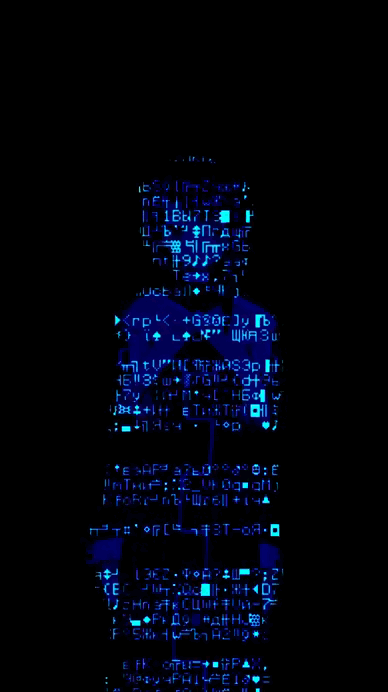

<!-- ================= HERO SECTION ================= -->

 

<h1 align="center">
  M A R I A
   
  B A P T I S T A
</h1>

  <strong>
    AI-First Full Stack Software Engineer
  </strong>

  Java • Spring Boot • Angular • React • Node.js • AI Engineering

 

 

<!-- Premium divider -->

<table>
<tr>

<td width="33%" align="center">

<h3>🤖 AI-First</h3>

I use AI agents as engineering partners to design, build, test and improve software.

</td>

<td width="33%" align="center">

<h3>⚙️ Full Stack</h3>

Building modern applications across backend, frontend, APIs and databases.

</td>

<td width="33%" align="center">

<h3>🌍 Remote Engineer</h3>

Collaborating with international teams and delivering software globally.

</td>

</tr>
</table>

 

<em>
"Building software where human creativity meets artificial intelligence."
</em>

 

<!-- Social badges -->

 

<!-- End Hero -->

<!-- ================= ABOUT ME ================= -->

  

  

<h2 align="center">
  🧠 About Me
</h2>

  I build software at the intersection of
  <strong>Full Stack Engineering, Artificial Intelligence, and Product Development.</strong>

 

I don't see AI as a replacement for engineers.
 
I see it as an engineering multiplier.
  
My approach combines strong software fundamentals,
 
modern architectures, and AI-assisted workflows
 
to create reliable and scalable digital products.

 

<table width="100%" align="center">

<tr>

<td width="33%" valign="top">

 

<strong>Full Stack Engineering</strong>

 

<small>
Building Products
</small>

 

I design and develop complete software solutions,
from backend architecture and APIs to modern frontend experiences.

My experience includes:

- Java & Spring Boot
- Angular
- React
- Node.js
- TypeScript
- Databases
- REST APIs
- Scalable application design

I enjoy transforming ideas into reliable products.

</td>

<td width="33%" valign="top">

 

<strong>AI-First Engineering</strong>

 

<small>
Engineering With Agents
</small>

 

AI is part of my daily development workflow.

I use AI agents and assistants to:

- Explore architectures
- Generate implementation approaches
- Refactor code
- Debug problems
- Create tests
- Improve documentation
- Accelerate MVP development

Tools I work with:

- Cursor
- Claude
- ChatGPT
- GitHub Copilot
- Lovable
- Base44
- Gamma
- Replit AI
- Other agentic workflows

</td>

<td width="33%" valign="top">

 

<strong>Reliability Mindset</strong>

 

<small>
Quality & Security
</small>

 

My background in AI reliability and QA shaped how I build software.

I focus on:

- Software quality
- Edge-case thinking
- Testing strategies
- Debugging
- Secure development
- System reliability

I believe great software is not only functional — it is predictable, maintainable, and trustworthy.

</td>

</tr>

</table>

 

<blockquote>

<strong>
"Great engineers don't just write code.
They design systems, solve problems, and continuously improve how software is built."
</strong>

</blockquote>

 

<!-- ================= AI-FIRST ENGINEERING WORKFLOW ================= -->

  

<h2 align="center">
  🤖 AI-First Engineering Workflow
</h2>

I don't use AI to replace engineering thinking.

 

I use AI to amplify architecture, creativity,
problem-solving and delivery speed.

 

<table width="100%">

<tr>

<td width="14%" align="center">

 

<strong>
01
 
Discovery
</strong>

 

<small>
Understanding
problems
</small>

</td>

<td width="14%" align="center">

 

<strong>
02
 
Architecture
</strong>

 

<small>
Designing
solutions
</small>

</td>

<td width="14%" align="center">

 

<strong>
03
 
AI Agents
</strong>

 

<small>
Collaborative
development
</small>

</td>

<td width="14%" align="center">

 

<strong>
04
 
Development
</strong>

 

<small>
Building
features
</small>

</td>

<td width="14%" align="center">

 

<strong>
05
 
Validation
</strong>

 

<small>
Quality
checks
</small>

</td>

<td width="14%" align="center">

 

<strong>
06
 
Delivery
</strong>

 

<small>
Deploying
systems
</small>

</td>

<td width="14%" align="center">

 

<strong>
07
 
Iteration
</strong>

 

<small>
Continuous
improvement
</small>

</td>

</tr>

</table>

 

---

<h3 align="center">
⚡ My AI Engineering Toolkit
</h3>

 

 

<table width="100%">

<tr>

<td width="50%" valign="top">

<h3 align="center">
🧠 AI-Assisted Development
</h3>

Using AI throughout the engineering lifecycle:

<ul>

<li>Architecture exploration</li>

<li>Code generation and refinement</li>

<li>Debugging complex issues</li>

<li>Testing strategies</li>

<li>Documentation improvement</li>

<li>Rapid prototyping</li>

</ul>

</td>

<td width="50%" valign="top">

<h3 align="center">
🔒 Human Engineering Layer
</h3>

AI output still requires engineering judgment:

<ul>

<li>Security evaluation</li>

<li>Performance considerations</li>

<li>Maintainability review</li>

<li>System design decisions</li>

<li>Production readiness</li>

<li>Quality standards</li>

</ul>

</td>

</tr>

</table>

 

<blockquote>

<strong>

"AI generates possibilities.
Engineers create reliable systems."

</strong>

</blockquote>

<!-- ================= END AI WORKFLOW ================= -->

<!-- ================= TECHNICAL STACK ================= -->

<table width="100%">
<tr>

<td width="50%" align="left">

</td>

<td width="50%" align="center">

</td>

</tr>

<tr>

<td width="50%" align="center">

</td>

<td width="50%" align="right">

</td>

</tr>

</table>

<h2 align="center">
  ⚙️ Technical Stack
</h2>

Technologies I use to design, build, test and deliver modern software systems.

 

<!-- CORE STACK -->

<h3 align="center">
🔥 Core Engineering Stack
</h3>

 

<table width="100%">

<tr>

<td width="50%" valign="top">

<h3 align="center">
💻 Frontend Engineering
</h3>

<ul>

<li>Angular application development</li>

<li>React-based interfaces</li>

<li>Component architecture</li>

<li>Responsive UI development</li>

<li>Modern JavaScript patterns</li>

<li>Frontend performance optimization</li>

</ul>

</td>

<td width="50%" valign="top">

<h3 align="center">
🚀 Backend Engineering
</h3>

<ul>

<li>REST API design</li>

<li>Backend architecture</li>

<li>Business logic development</li>

<li>Database integration</li>

<li>Service-oriented systems</li>

<li>API security practices</li>

</ul>

</td>

</tr>

</table>

 

<table width="100%">

<tr>

<td width="33%" align="center">

<h3>
🗄️ Data
</h3>

  

SQL

 

Database Modeling

 

Data Integration

</td>

<td width="33%" align="center">

<h3>
🛠️ DevOps
</h3>

  

Version Control

 

Containerization

 

CI/CD Concepts

</td>

<td width="33%" align="center">

<h3>
🤖 AI Engineering
</h3>

  

LLM Evaluation

 

Prompt Engineering

 

AI Agents

 

Automation

</td>

</tr>

</table>

 

---

<h3 align="center">
🧩 Engineering Practices
</h3>

 

<blockquote>

<strong>

"Technology choices matter.
Engineering decisions matter more."

</strong>

</blockquote>

 

<!-- ================= END TECH STACK ================= -->

<!-- ================= FEATURED PROJECTS ================= -->

<h2 align="center">
  🚀 Featured Projects
</h2>

A collection of projects where I apply
<strong>software engineering, AI-assisted development,
and product thinking.</strong>

 

<table width="100%">

<!-- PROJECT 1 -->

<tr>

<td width="50%" valign="top">

<h3>
🟢 AngoGestor
</h3>

<strong>
Full Stack Productivity Platform
</strong>

A modern task and management application designed with a SaaS mindset, focusing on usability, scalability and future cloud deployment.

<strong>Engineering Focus:</strong>

<ul>

<li>Product-oriented development</li>

<li>Application architecture</li>

<li>User experience</li>

<li>Scalable features</li>

</ul>

<td width="50%" align="center">

</td>

</tr>

<!-- PROJECT 2 -->

<tr>

<td width="50%" align="center">

</td>

<td width="50%" valign="top">

<h3>
🏫 School Management System
</h3>

<strong>
Enterprise Management Application
</strong>

A complete school administration system built to manage structured information and business workflows.

<strong>Engineering Focus:</strong>

<ul>

<li>Frontend architecture</li>

<li>Backend integration</li>

<li>Business rules</li>

<li>Data management</li>

</ul>

</td>

</tr>

<!-- PROJECT 3 -->

<tr>

<td width="50%" valign="top">

<h3>
🤖 AI Home Hub
</h3>

<strong>
AI-Powered Application Experiment
</strong>

An exploration of AI-powered workflows and modern application development using emerging AI tools.

<strong>Engineering Focus:</strong>

<ul>

<li>AI-assisted building</li>

<li>Rapid prototyping</li>

<li>Modern development workflows</li>

</ul>

</td>

<td width="50%" align="center">

</td>

</tr>

<!-- PROJECT 4 -->

<tr>

<td width="50%" align="center">

</td>

<td width="50%" valign="top">

<h3>
⛓ Ethereum Transaction Pool Simulator
</h3>

<strong>
Blockchain Systems Simulation
</strong>

A technical project exploring Ethereum transaction flows, mempool behavior and decentralized system concepts.

<strong>Engineering Focus:</strong>

<ul>

<li>Complex logic simulation</li>

<li>System visualization</li>

<li>Performance thinking</li>

</ul>

</td>

</tr>

<!-- PROJECT 5 -->

<tr>

<td width="50%" valign="top">

<h3>
📋 Task Manager
</h3>

<strong>
Full Stack Productivity Application
</strong>

A clean task management application demonstrating authentication, data handling and modern application patterns.

</td>

<td width="50%" align="center">

</td>

</tr>

</table>

 

<em>

More projects available in my GitHub repositories.

</em>

 

<!-- ================= END FEATURED PROJECTS ================= -->

<!-- ================= GITHUB ANALYTICS ================= -->
<!-- ================= GITHUB ANALYTICS ================= -->

<h2>

 GitHub Analytics
</h2>

Engineering activity, experimentation and continuous improvement.

 

<table width="100%">

<tr>

<td width="50%" align="center">

</td>

<td width="50%" align="center">

</td>

</tr>

</table>

 

<h3>

 Technology Distribution

</h3>

 

<h3>

 Development Activity

</h3>

 

<h3>

 Contribution Journey

</h3>

 

<table width="100%"
style="border:1px solid #00A8FF;">

<tr>

<td align="center" width="33%">

<h3>
Engineering Focus
</h3>

Full Stack Systems

 

AI Development

 

Software Architecture

</td>

<td align="center" width="33%">

<h3>
Current Learning
</h3>

Java Ecosystem

 

Cloud Architecture

 

Agentic AI

</td>

<td align="center" width="33%">

<h3>
Workflow
</h3>

Remote Engineering

 

Open Source

 

Continuous Delivery

</td>

</tr>

</table>

 

  

<blockquote>

<strong>

Engineering is the discipline of turning ideas into reliable systems.

</strong>

</blockquote>

<!-- ================= END ANALYTICS ================= -->

<!-- ================= END GITHUB ANALYTICS ================= -->

<!-- ================= CURRENT FOCUS + ENGINEERING PHILOSOPHY ================= -->

  

<h2 align="center">
  🎯 Current Focus
</h2>

Currently building deeper expertise at the intersection of

 

<strong>
Software Engineering × Artificial Intelligence × Scalable Systems
</strong>

 

<table width="100%">

<tr>

<td width="50%" valign="top">

<h3 align="center">
🤖 AI Engineering
</h3>

Exploring how AI agents can become part of modern engineering workflows.

<ul>

<li>Agentic development workflows</li>

<li>LLM reliability and evaluation</li>

<li>Prompt engineering</li>

<li>AI-assisted software delivery</li>

<li>Automation of engineering processes</li>

</ul>

</td>

<td width="50%" valign="top">

<h3 align="center">
⚙️ Software Architecture
</h3>

Designing systems that are reliable, maintainable and ready to scale.

<ul>

<li>Java & Spring Boot ecosystem</li>

<li>Backend architecture</li>

<li>API design</li>

<li>Distributed systems concepts</li>

<li>Cloud-native development</li>

</ul>

</td>

</tr>

<tr>

<td width="50%" valign="top">

<h3 align="center">
🔒 Quality & Security
</h3>

Building software with reliability as a requirement, not an afterthought.

<ul>

<li>Secure coding practices</li>

<li>Testing strategies</li>

<li>Edge-case analysis</li>

<li>System validation</li>

<li>Production mindset</li>

</ul>

</td>

<td width="50%" valign="top">

<h3 align="center">
🌍 Global Engineering
</h3>

Growing through collaboration with international teams and remote environments.

<ul>

<li>Remote-first collaboration</li>

<li>Technical communication</li>

<li>Open-source mindset</li>

<li>Continuous improvement</li>

<li>Product ownership</li>

</ul>

</td>

</tr>

</table>

 

<!-- ENGINEERING PHILOSOPHY -->

<h2 align="center">
  🧠 Engineering Philosophy
</h2>

<blockquote>

<strong>

"I believe great software is created when strong engineering fundamentals meet intelligent tools."

</strong>

</blockquote>

 

My approach:

<table width="100%">

<tr>

<td align="center" width="25%">

<h3>
01
</h3>

<strong>
Understand
</strong>

 

Solve the right problem before writing code.

</td>

<td align="center" width="25%">

<h3>
02
</h3>

<strong>
Design
</strong>

 

Create simple and scalable solutions.

</td>

<td align="center" width="25%">

<h3>
03
</h3>

<strong>
Build
</strong>

 

Deliver reliable software with modern tools.

</td>

<td align="center" width="25%">

<h3>
04
</h3>

<strong>
Improve
</strong>

 

Learn, measure and continuously evolve.

</td>

</tr>

</table>

 

<blockquote>

<strong>

"AI increases the speed of creation.
Engineering determines the quality of the result."

</strong>

</blockquote>

 

<!-- ================= END CURRENT FOCUS ================= -->

<!-- ================= PREMIUM FINAL FOOTER ================= -->

 

  

<h2>
  🚀 Building The Future of Software
</h2>

<strong>
AI-First Full Stack Engineer
</strong>

 

Java • Spring Boot • Angular • React • Agentic Workflows

 

<table width="90%">

<tr>

<td width="25%" align="center">

<h1>🤖</h1>

<strong>
AI Engineering
</strong>

 

<small>
Agents • LLMs • Automation
</small>

</td>

<td width="25%" align="center">

<h1>⚙️</h1>

<strong>
Full Stack
</strong>

 

<small>
Backend • Frontend • APIs
</small>

</td>

<td width="25%" align="center">

<h1>🔒</h1>

<strong>
Reliability
</strong>

 

<small>
Quality • Security • Testing
</small>

</td>

<td width="25%" align="center">

<h1>🌍</h1>

<strong>
Remote
</strong>

 

<small>
Global Engineering
</small>

</td>

</tr>

</table>

 

  

<blockquote>

<h3>

"Software is not only written.
 
It is designed, tested, improved and evolved."

</h3>

</blockquote>

 

<strong>
Maria Baptista
</strong>

 

AI-First Full Stack Software Engineer

 

<!-- CONTACT BUTTONS -->

 

 

 

<em>

"Human creativity.
 
Artificial intelligence.
 
Engineering excellence."

</em>

<!-- ================= END PREMIUM FOOTER ================= -->
